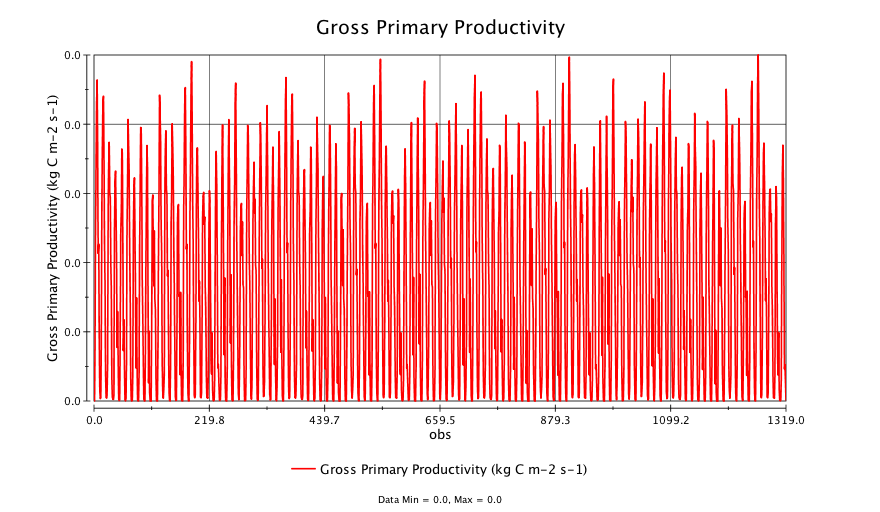
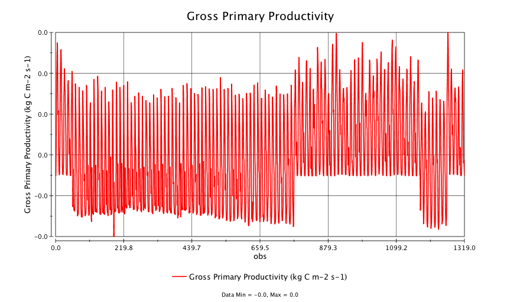
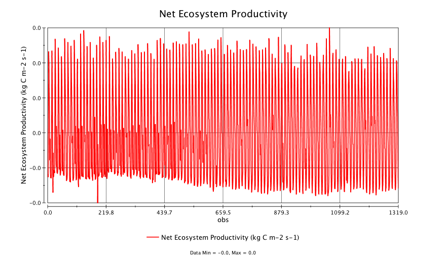
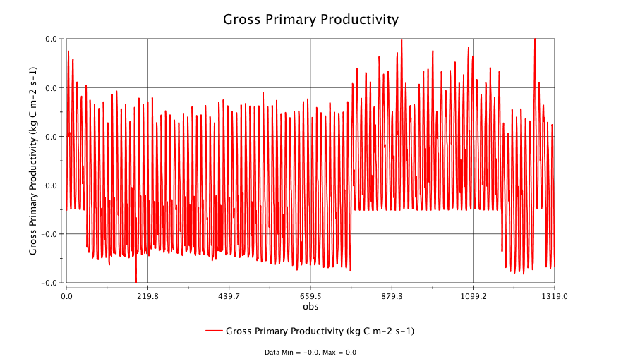

# Methodology of and Findings from the Test

Table of Contents
=================

* [Methodology of and Findings from the Test](#methodology-of-and-findings-from-the-test)
  * [Objective](#objective)
  * [Scope](#scope)
  * [Methodology](#methodology)
  * [Findings](#findings)
    * [1\. THREDDS NCSS could randomly return incorrect data](#1-thredds-ncss-could-randomly-return-incorrect-data)
    * [2\. Result returned could contain data read from a data layer different from what's requested](#2-result-returned-could-contain-data-read-from-a-data-layer-different-from-whats-requested)
    * [3\. Result returned could contain data extracted at a point different from what's requested](#3-result-returned-could-contain-data-extracted-at-a-point-different-from-whats-requested)
    * [4\. Result returned could contain part (or none) of the time steps requested\.](#4-result-returned-could-contain-part-or-none-of-the-time-steps-requested)
    * [5\. This incorrect data issue applies to netcdf response format, but possibly to other formats as well\.](#5-this-incorrect-data-issue-applies-to-netcdf-response-format-but-possibly-to-other-formats-as-well)
    * [6\. The incorrect data issue happens randomly and chance that this issue happens increases as the server load goes up](#6-the-incorrect-data-issue-happens-randomly-and-chance-that-this-issue-happens-increases-as-the-server-load-goes-up)
  * [Appendix: Findings from specific test scenarios](#appendix-findings-from-specific-test-scenarios)
    * [A\.1 Test on ORNL DAAC Public THREDDS [2020\-06\-09 21:38]](#a1-test-on-ornl-daac-public-thredds-2020-06-09-2138)
    * [A\.2 Test on PO\.DAAC THREDDS [2020\-06\-11 11:46]](#a2-test-on-podaac-thredds-2020-06-11-1146)
    * [A\.3 Test on ORNL DAAC Public THREDDS [2020\-06\-11 16:49]](#a3-test-on-ornl-daac-public-thredds-2020-06-11-1649)

Created by [gh-md-toc](https://github.com/ekalinin/github-markdown-toc.go)

## Objective
The objective of the test is to check if THREDDS data services always return 
the same result for the same data subset request, no matter how many times the 
request is sent, when it is send, or the system load of the THREDDS data server.

## Scope
The scope of the test currently focuses on THREDDS NetCDF Subset Service (NCSS)'s 
<q>Grid as Point Dataset</q> option.

## Methodology
Methodology of the test is to run the same THREDDS NCSS requests repeatedly and 
then check if the service always return the same data.

Two Python scripts were developed to do the test. 

The first Python script (i.e. download_base.py) reads in a JSON file, which 
contains a list of THREDDS NCSS request URLs. It then runs through each request 
URL to retrieve data from the server and save the result into a file, which is 
considered to be the <q>base</q> data.

The second Python script (i.e. download_test.py) reads in the same JSON file. It 
will also run through each request URL to retrieve data from the server and save 
the result into a file, which is considered to be the <q>test</q> data. It will 
then compare each pair of the base and test files through their MD5 checksums. 
If their MD5 checksums are different, it means the same request URL yielded a 
result data (i.e. <q>test</q> data) different from the <q>base</q> data and 
indicates the THREDDS service has a problem.  
Note that the second Python script 
retrieves data from these NCSS request URLs in an asynchronized way. This allows 
one or more (controlled by the concurrent_level setting) request URLs to be sent 
to the server simultaneously. This feature is critical for the test since it allows
us to test the behavior of the service under different system load, e.g. fewer 
simultaneous requests v.s. more simultaneous requests being handled by the server.

## Findings
### 1. THREDDS NCSS could randomly return incorrect data
We observed that NCSS randomly returned incorrect, or inconsistent, data 
when the same request was repeated many times. This issue was observed in all 
the THREDDS data servers we tested, including:
*  ORNL DAAC THREDDS data servers
   * Instances setup to deliver Daymet data to AppEEARS
      * https://thredds.daac.ornl.gov/thredds-daymet/ (actual data processing is handled by the three server nodes below)  
      * https://daymetthredds-dev.ornl.gov:8443/thredds-daymet/ (v4.6.14) 
      * https://daymetthredds2-dev.ornl.gov:8443/thredds-daymet/ (v4.6.1)
      * https://daymetthredds3-dev.ornl.gov:8443/thredds-daymet/ (v4.6.14)
   * Instances setup to distribute ORNL DAAC datasets
      * https://thredds.daac.ornl.gov/thredds/ (actual data processing is handled by the two server nodes below)
      * https://gistds1.ornl.gov:8443/thredds/ (v4.6.6)
      * https://gistds2.ornl.gov:8443/thredds/ (v4.6.6)
*  PO.DAAC THREDDS data server
  * https://thredds.jpl.nasa.gov/thredds (v4.6.14)

### 2. Result returned could contain data read from a data layer different from what's requested
In some tests that resulted in incorrect data returned, we observed the 
result returned contained data read in by THREDDS from a data layer different 
from what was requested. See <q>Findings from specific test scenarios</q> for a detailed 
description of this issue.

### 3. Result returned could contain data extracted at a point different from what's requested
In some tests that resulted in incorrect data returned, we observed the 
result returned contained data extracted by THREDDS from a point (as defined by the latitude 
and longitude coordinates) different from what was requested. See <q>Findings from specific 
test scenarios</q> for a detailed description of this issue.

### 4. Result returned could contain part (or none) of the time steps requested.
In some tests that resulted in incorrect data returned, we observed that the result returned could
be incomplete (e.g. 20 time steps returned instead of the requested 1320 time steps) or even contain 
no data values at all. See <q>Findings from specific test scenarios</q> for a detailed description of this issue.

### 5. This incorrect data issue applies to netcdf response format, but possibly to other formats as well.
We observed this incorrect data issue for requests with netcdf data format, specified by the accept param in the request URL
*  accept=netcdf

We occasionally saw "truncated" result data with csv response format. But we are not clear if this issue is caused by THREDDS data server. 

Our tests didn't include other response formats (e.g. xml). It's possible that 
this issue applies to other formats as well.


### 6. The incorrect data issue happens randomly and chance that this issue happens increases as the server load goes up
This incorrect data issue happens randomly. Many of our tests resulted correct data returned.  
We observed the chance for this incorrect data issue to happen increased as we 
increased the concurrently_level setting in the download_test.py script, which 
means the test script sent more NCSS requests to the target THREDDS data server 
at the same time, thus increasing the system load on the server. 

## Appendix: Findings from specific test scenarios
### A.1 Test on ORNL DAAC Public THREDDS [2020-06-09 21:38] 
**Request URLs used for testing**  
20 NCSS request URLs were used in this test. These 20 request URLs are specified 
in this JSON file: [gistds1_requests_ncss_ds1225_diffdata_netcdf.json](./Test_Results/gistds1_ds1225_diffdata.202006092138/gistds1_requests_ncss_ds1225_diffdata_netcdf.json)

Each of these 20 requests subsets data from a different data layer. In addition, 
subset point location (specified by the latitude and longitude params) is unique 
among those 20 requests. Purpose of this design is to better track this issue.
For example, the request URL #02 and #19 are:
* Request URL #02: https://gistds1.ornl.gov:8443/thredds/ncss/ornldaac/1225/CLM4_RG1_Monthly/CLM4_RG1_Monthly_GPP.nc4?var=GPP&time_start=1901-01-15T00:00:00Z&time_end=2010-12-15T00:00:00Z&accept=netcdf&latitude=49.206562&longitude=-111.220313
* Request URL #19: https://gistds1.ornl.gov:8443/thredds/ncss/ornldaac/1225/CLM4_SG2_Monthly/CLM4_SG2_Monthly_NEP.nc4?var=NEP&time_start=1901-01-15T00:00:00Z&time_end=2010-12-15T00:00:00Z&accept=netcdf&latitude=42.016562&longitude=-110.770938

**Testing**  
The download_test.py script was run multiple times on this set of 20 request URLs. 
The concurrent_level was set to 4. In one of the runs, we observed two <q>test</q> 
data (i.e. data returned by request URLs #02 and #19) were not identical to the 
<q>base</q> data. Below is the messages printed by the download_test.py.  

```
[ywi@daac-proc compare_downloads]$ python3 download_test_nonstream.py  | grep ERROR
2020-06-09 21:38:09,229	ERROR	checksums ne ./download_gistds1_ds1225_diffdata/base19.nc 80138248766477fbf080b4a2385e20fe
2020-06-09 21:38:09,365	ERROR	checksums ne ./download_gistds1_ds1225_diffdata/base02.nc eb996cfa3c161388d23e0a95416f3eed
```
These 4 data files can be access following the links below:
* [gistds1_ds1225_diffdata.202006092138/base02.nc](./Test_Results/gistds1_ds1225_diffdata.202006092138/base02.nc)
* [gistds1_ds1225_diffdata.202006092138/test02.nc](./Test_Results/gistds1_ds1225_diffdata.202006092138/test02.nc)
* [gistds1_ds1225_diffdata.202006092138/base19.nc](./Test_Results/gistds1_ds1225_diffdata.202006092138/base19.nc)
* [gistds1_ds1225_diffdata.202006092138/test19.nc](./Test_Results/gistds1_ds1225_diffdata.202006092138/test19.nc)

**Investigation of the incorrect data files**
A NetCDF file created and returned by the NCSS' <q>Grid as Point Dataset</q> option
contains the following global attributes:
* **title**: This attribute provides a descriptive title for the returned NetCDF file. NCSS assigns it with the <q>Extract Points data from Grid file FILEPATH</q>, where `FILEPATH` indicates which data file the data values were read from. 
* **geospatial_lat_min, geospatial_lat_max, geospatial_lon_min, and geospatial_lon_max**: These 4 attributes specify the spatial boundary of the grid pixel within which the subset point location falls.
* **time_coverage_start and time_coverage_end**: These 2 attributes indicate the start and end time steps in the returned NetCDF file. They should match (though not necessarily identical) the time_start and time_end params in the request URL.
These global attributes are useful to troubleshoot the result data. Below are 
the global attributes included in base02.nc and base19.nc. We can tell that values 
of those attributes match the values of the params specified in the corresponding 
request URLs.

**Global attributes of base02.nc**
```
// global attributes:
		:Conventions = "CF-1.6" ;
		:history = "Written by CFPointWriter" ;
		:title = "Extract Points data from Grid file /daacftp/nacp/NACP_MsTMIP_TBMO/data/CLM4_RG1_Monthly/CLM4_RG1_Monthly_GPP.nc4" ;
		:time_coverage_start = "1901-01-15T00:00:00Z" ;
		:time_coverage_end = "2010-12-15T00:00:00Z" ;
		:geospatial_lat_min = 49.206062 ;
		:geospatial_lat_max = 49.207062 ;
		:geospatial_lon_min = -111.220813 ;
		:geospatial_lon_max = -111.219813 ;
		:featureType = "timeSeries" ;
```
**Global attributes of base19.nc**
```
// global attributes:
		:Conventions = "CF-1.6" ;
		:history = "Written by CFPointWriter" ;
		:title = "Extract Points data from Grid file /daacftp/nacp/NACP_MsTMIP_TBMO/data/CLM4_SG2_Monthly/CLM4_SG2_Monthly_NEP.nc4" ;
		:time_coverage_start = "1901-01-15T00:00:00Z" ;
		:time_coverage_end = "2010-12-15T00:00:00Z" ;
		:geospatial_lat_min = 42.016062 ;
		:geospatial_lat_max = 42.017062 ;
		:geospatial_lon_min = -110.771438 ;
		:geospatial_lon_max = -110.770438 ;
		:featureType = "timeSeries" ;
```

**Issue with test02.nc**  
In the test done at 2020-06-09 21:38, the test script reported test02.nc was not 
identical to base02.nc. So we compared their 1) global attributes and 2) data values.

Below are the global attributes of test02.nc. They are identical to those of base02.nc.
```
// global attributes:
		:Conventions = "CF-1.6" ;
		:history = "Written by CFPointWriter" ;
		:title = "Extract Points data from Grid file /daacftp/nacp/NACP_MsTMIP_TBMO/data/CLM4_RG1_Monthly/CLM4_RG1_Monthly_GPP.nc4" ;
		:time_coverage_start = "1901-01-15T00:00:00Z" ;
		:time_coverage_end = "2010-12-15T00:00:00Z" ;
		:geospatial_lat_min = 49.206062 ;
		:geospatial_lat_max = 49.207062 ;
		:geospatial_lon_min = -111.220813 ;
		:geospatial_lon_max = -111.219813 ;
		:featureType = "timeSeries" ;
```

Below are plots of the GPP data variable from both base02.nc (top) and test02.nc (bottom). 
They are clearly different from each other. In addition, GPP values in test02.png 
are incorrect, since GPP values should be positive.



**Issue with test19.nc**  
In the test done at 2020-06-09 21:38, the test script also reported test19.nc was not 
identical to base19.nc. So we compared their 1) global attributes and 2) data values.

Below are the global attributes of test19.nc. They are **NOT** identical to those of base19.nc.
It's interesting to see that geospatial and time attributes are identical to those
of base19.nc, but the title attribute is NOT. It indicates that the data points were
extracted from `/daacftp/nacp/NACP_MsTMIP_TBMO/data/CLM4_RG1_Monthly/CLM4_RG1_Monthly_GPP.nc4`. 
This is wrong since URL #19 requested the **NEP** data variable instead of **GPP**.

It's interesting to see that **the wrong data layer (i.e. CLM4_RG1_Monthly_GPP.nc4) didn't come from nowhere. It's actually the data layer requested in URL #02**.

```
// global attributes:
		:Conventions = "CF-1.6" ;
		:history = "Written by CFPointWriter" ;
		:title = "Extract Points data from Grid file /daacftp/nacp/NACP_MsTMIP_TBMO/data/CLM4_RG1_Monthly/CLM4_RG1_Monthly_GPP.nc4" ;
		:time_coverage_start = "1901-01-15T00:00:00Z" ;
		:time_coverage_end = "2010-12-15T00:00:00Z" ;
		:geospatial_lat_min = 42.016062 ;
		:geospatial_lat_max = 42.017062 ;
		:geospatial_lon_min = -110.771438 ;
		:geospatial_lon_max = -110.770438 ;
		:featureType = "timeSeries" ;
```

Below are plots of the NEP data variable from base19.nc (top) and the GPP data 
variable from test19.nc (bottom). They are not directly comparable since the data 
variables are different.  



### A.2 Test on PO.DAAC THREDDS [2020-06-11 11:46] 
**Request URLs used for testing**  
20 NCSS request URLs were used in this test. These 20 request URLs are specified 
in this JSON file: [podaac_requests_ncss_samedata_netcdf.json](./Test_Results/podaac_samedata.202006111146/podaac_requests_ncss_samedata_netcdf.json)

All these 20 requests subset data from the same data layer. In addition, 
subset point location (specified by the latitude and longitude params) is unique 
among those 20 requests.
For example, the request URL #01 and #12 are:
* Request URL #01: https://thredds.jpl.nasa.gov/thredds/ncss/ncml_aggregation/OceanTemperature/modis/terra/11um/9km/aggregate__MODIS_TERRA_L3_SST_THERMAL_DAILY_9KM_DAYTIME_V2019.0.ncml?var=sst&time_start=2018-01-01T00:00:00Z&time_end=2018-12-31T00:00:00Z&accept=netcdf&latitude=34.631306&longitude=-55.379109
* Request URL #12: https://thredds.jpl.nasa.gov/thredds/ncss/ncml_aggregation/OceanTemperature/modis/terra/11um/9km/aggregate__MODIS_TERRA_L3_SST_THERMAL_DAILY_9KM_DAYTIME_V2019.0.ncml?var=sst&time_start=2018-01-01T00:00:00Z&time_end=2018-12-31T00:00:00Z&accept=netcdf&latitude=38.523976&longitude=-92.066292

**Testing**  
The download_test.py script was run multiple times on this set of 20 request URLs. 
The concurrent_level was set to 4. In one of these runs, we observed two <q>test</q> 
data (i.e. data returned by request URLs #01 and #12) were not identical to the 
<q>base</q> data. Below is the messages printed by the download_test.py.  

```
[ywi@daac-proc compare_downloads]$ python3 download_test.py | grep ERROR
2020-06-11 11:46:45,615	ERROR	checksums ne ./download_podaac_samedata/base12.nc 3ec87e7db83aac81aeb0c364c66a2906
2020-06-11 11:46:45,777	ERROR	checksums ne ./download_podaac_samedata/base01.nc 280eb2ceb9967c54ba853cc247efe389
```
These 2 pairs, or 4, data files can be access following the links below:
* [podaac_samedata.202006111146/base01.nc](./Test_Results/podaac_samedata.202006111146/base01.nc)
* [podaac_samedata.202006111146/test01.nc](./Test_Results/podaac_samedata.202006111146/test01.nc)
* [podaac_samedata.202006111146/base12.nc](./Test_Results/podaac_samedata.202006111146/base12.nc)
* [podaac_samedata.202006111146/test12.nc](./Test_Results/podaac_samedata.202006111146/test12.nc)

**Issue with test01.nc**  
Difference between test01.nc and base01.nc lies only in the slight difference between the precision of the matched point location, as shown below. The data values of each file are still identical. So this is not a significant issue and can be safely ignored.
```
[ywi@daac-proc download_podaac_samedata.202006111146]$ diff <(ncdump base01.nc) <(ncdump test01.nc)
1c1
< netcdf base01 {
---
> netcdf test01 {
6c6
< 	station_description_strlen = 42 ;
---
> 	station_description_strlen = 43 ;
53c53
<   "Grid Point at lat/lon=34.631306,-55.379109" ;
---
>   "Grid Point at lat/lon=34.631306,-55.3791096" ;
```

**Issue with test12.nc**  
Differences between test12.nc and base12.nc lies in two places:
* Data values in test12.nc were extracted from a point location (lat=34.631306, lon=-55.379109) different from 
the point location requested (lat=35.009165, lon=-130.729216)
* Data values in test12.nc are different from those in base12.nc, since data values were extracted from a different point location.
These are serious issues.

It's interesting to see that **the wrong point location (lat=35.009165, lon=-130.729216) didn't come from nowhere. It's actually the point location used in request URL #01**.

```
[ywi@daac-proc download_podaac_samedata.202006111146]$ diff <(ncdump base12.nc) <(ncdump test12.nc)
1c1
< netcdf base12 {
---
> netcdf test12 {
45c45
<  latitude = 35.009165 ;
---
>  latitude = 34.631306 ;
47c47
<  longitude = -130.729216 ;
---
>  longitude = -55.379109 ;
53c53
<   "Grid Point at lat/lon=35.009165,-130.729216" ;
---
>   "Grid Point at lat/lon=34.631306,-55.3791096" ;
104,122c104,129
<  sst = 3898, _, _, _, _, _, _, _, _, _, _, _, _, 4276, 4270, 4172, _, 4220, 
<     _, _, 4189, 4027, _, _, _, _, _, _, _, _, _, _, _, _, _, _, _, _, 4262, 
<     _, _, _, 4312, _, _, _, _, _, _, 4448, _, _, _, _, 3412, 4528, _, _, 
<     4495, 4518, _, _, _, 4532, 4371, _, _, _, _, _, _, _, _, _, 4140, _, _, 
<     _, _, _, _, _, _, _, _, _, _, _, 4296, _, _, 4243, 4296, _, _, _, _, _, 
<     _, _, 4299, 4336, _, _, _, _, _, _, _, _, _, _, _, _, _, _, _, _, 4451, 
<     _, _, _, _, _, _, _, 4299, _, 4392, 4321, _, _, _, _, _, _, _, _, _, 
<     4100, 4261, _, _, _, _, _, _, _, _, _, _, _, _, _, 4078, _, 4019, _, 
<     4040, 4128, _, 3997, _, _, _, _, 3945, _, _, _, _, _, _, _, _, _, _, _, 
<     _, _, _, 3866, 3919, 3926, 3842, _, 3734, _, _, _, _, _, _, _, _, _, _, 
<     _, 3894, _, _, _, _, _, _, _, _, _, _, _, _, 3702, _, _, _, _, _, _, _, 
<     _, _, _, _, _, _, _, _, _, _, _, 3502, _, _, _, _, _, 3646, _, _, _, _, 
<     _, _, _, _, 3652, 3737, _, _, _, 3600, _, _, _, _, _, _, 3059, _, _, 
<     3496, 3415, 3658, 3639, _, _, _, _, _, _, _, _, 3407, _, _, _, _, _, _, 
<     _, 3678, _, 3392, _, _, _, _, _, _, _, _, _, _, _, _, _, _, _, 2567, 
<     3536, _, _, _, 3005, _, 3156, _, _, _, _, 2949, 3816, 3835, 3893, 3829, 
<     3874, 3865, 3814, _, _, _, 3858, _, _, _, _, _, _, _, _, _, _, _, 3963, 
<     3875, 4128, _, 4086, _, 4113, 4317, 4188, 4189, _, _, 4125, 4112, _, 
<     4134, _, _, _, _, _, _, _, _, _, _, _, _, _, 4142, _, _ ;
---
>  sst = 5211, 5260, _, 5317, _, 5287, 5240, 5254, 5200, 5245, _, _, _, _, _, 
>     _, _, _, 5249, 4836, _, 5267, 5290, 5251, 5264, 5301, 5483, _, 5448, 
>     5302, 5398, _, 5546, 5514, 5404, 5385, _, 5479, _, 5447, 5560, 5648, _, 
>     _, 5621, 5307, 5565, 5574, _, 5672, _, 5604, _, 5539, 5608, 5594, 5652, 
>     _, 5541, _, _, _, _, _, 5475, 5429, _, _, _, 5519, 5482, 5359, 5415, 
>     5396, _, _, _, 5256, 5286, 5392, 5392, 5282, _, 5397, _, 5403, _, _, 
>     5421, 5352, 5150, _, 5417, _, 5327, _, _, 5052, _, _, _, 5395, _, 5432, 
>     _, 5277, 5389, 5405, 5362, 5266, 5370, 5244, 5426, 5265, _, 5246, _, 
>     5264, 5285, 5049, 5096, _, 5196, 5229, 5199, 5208, _, 5228, 5312, _, 
>     4987, 5206, _, 5139, _, 5368, 5254, _, 5274, 5220, 5217, _, 5185, _, 
>     5099, 5168, 5197, 5092, _, 5036, 4910, 5097, 5212, _, 5049, 5131, 5073, 
>     _, _, _, 5042, 5044, 4867, _, _, 4950, 4960, _, 5027, 4928, 4845, 4725, 
>     _, 4904, 4907, 4861, _, _, _, 4843, _, 4844, 4785, 4866, _, _, 4765, 
>     4797, 4644, _, 4770, 4792, _, 4731, 4586, _, _, 4740, _, 4849, 4816, _, 
>     _, _, 4735, _, 4627, 4796, 4780, 4746, _, _, _, 4656, 4739, 4767, 4777, 
>     4635, 4675, 4547, 4640, 4566, 4728, 4832, _, 4589, 4549, 4657, _, _, 
>     4472, _, 4645, 4480, 4619, 4456, 4576, _, 4593, 4508, 4613, _, 4485, _, 
>     _, _, 4534, _, _, 4525, 4545, _, 4590, _, 4615, 4460, _, _, 4446, 4574, 
>     _, 4622, 4664, 4564, 4609, 4574, 4606, _, 4606, 4486, 4583, 4538, 4475, 
>     4337, _, 4563, _, 4617, _, 4454, 4584, 4663, 4723, _, 4691, 4617, 4719, 
>     _, 4557, _, 4725, 4749, _, 4702, 4777, 4807, _, 4861, 4710, _, 4796, 
>     4846, 4882, 4885, 4930, _, _, 4831, _, 4854, _, _, 4794, 4722, 4922, 
>     4801, 5021, _, 4990, 4884, _, _, 4903, 4768, _, 4782, _, _, 4776, 4905, 
>     4930, _, _, 4958, 4814, 4972, _, 5056, 5132, 5043, _, 5024, 4969, 5092, 
>     5052, 5122, 5091, _, 5097, _, 4947, 5096, _, 5074, 4962, 5185, _, 4802, 
>     5243, 5341, 5372, 5375, 4142, _, _ ;
```
### A.3 Test on ORNL DAAC Public THREDDS [2020-06-11 16:49] 
**Request URLs used for testing**  
20 NCSS request URLs were used in this test. These 20 request URLs are specified 
in this JSON file: [gistds1_requests_ncss_ds1225_samedata_netcdf.json](./Test_Results/gistds1_ds1225_samedata.202006111649/gistds1_requests_ncss_ds1225_samedata_netcdf.json)

All these 20 requests subset data from the same data layer (i.e. CLM4_BG1_Monthly_GPP.nc4). 
But subset point location (specified by the latitude and longitude params) is unique among those 20 requests. 
For example, the request URL #01, #03, and #18 are:
* Request URL #01: https://gistds2.ornl.gov:8443/thredds/ncss/ornldaac/1225/CLM4_BG1_Monthly/CLM4_BG1_Monthly_GPP.nc4?var=GPP&time_start=1901-01-15T00:00:00Z&time_end=2010-12-15T00:00:00Z&accept=netcdf&latitude=39.769688&longitude=-99.536563 
* Request URL #03: https://gistds2.ornl.gov:8443/thredds/ncss/ornldaac/1225/CLM4_BG1_Monthly/CLM4_BG1_Monthly_GPP.nc4?var=GPP&time_start=1901-01-15T00:00:00Z&time_end=2010-12-15T00:00:00Z&accept=netcdf&latitude=-3.370313&longitude=-62.238438
* Request URL #18: https://gistds2.ornl.gov:8443/thredds/ncss/ornldaac/1225/CLM4_BG1_Monthly/CLM4_BG1_Monthly_GPP.nc4?var=GPP&time_start=1901-01-15T00:00:00Z&time_end=2010-12-15T00:00:00Z&accept=netcdf&latitude=48.757187&longitude=84.707188

**Testing**  
The download_test.py script was run multiple times on this set of 20 request URLs. 
The concurrent_level was set to 4. In one of the runs, we observed many <q>test</q> 
data were not identical to the <q>base</q> data. In addition, there was one test file 
returned from THREDDS with no data values included in the file.   
Below is the messages printed by the download_test.py.  

```
$ python3 download_test.py | grep ERROR
2020-06-11 16:49:53,135	ERROR	checksums ne ./download_gistds1_ds1225_samedata/base01.nc 7755f9045581074e2cd610232c18467d
2020-06-11 16:49:53,154	ERROR	    storing errors in ./error/2020-06-11-16-49-02/./download_gistds1_ds1225_samedata
2020-06-11 16:49:53,198	ERROR	checksums ne ./download_gistds1_ds1225_samedata/base20.nc 0459862226b320aaddce67d8242fdc7e
2020-06-11 16:49:53,199	ERROR	    storing errors in ./error/2020-06-11-16-49-02/./download_gistds1_ds1225_samedata
2020-06-11 16:49:53,707	ERROR	checksums ne ./download_gistds1_ds1225_samedata/base16.nc 0401cf0603cba85fec7b26dcf53376bd
2020-06-11 16:49:53,716	ERROR	    storing errors in ./error/2020-06-11-16-49-02/./download_gistds1_ds1225_samedata
2020-06-11 16:49:53,837	ERROR	checksums ne ./download_gistds1_ds1225_samedata/base02.nc 265f39a2ac7edda82a4fe00910b949da
2020-06-11 16:49:53,838	ERROR	    storing errors in ./error/2020-06-11-16-49-02/./download_gistds1_ds1225_samedata
2020-06-11 16:49:54,076	ERROR	checksums ne ./download_gistds1_ds1225_samedata/base11.nc 6711a8d5a558874c77e8dcdf49b9c786
2020-06-11 16:49:54,079	ERROR	    storing errors in ./error/2020-06-11-16-49-02/./download_gistds1_ds1225_samedata
2020-06-11 16:49:54,506	ERROR	checksums ne ./download_gistds1_ds1225_samedata/base17.nc 1e5f2893d69a55bee5b6d1e9d5c461a7
2020-06-11 16:49:54,518	ERROR	    storing errors in ./error/2020-06-11-16-49-02/./download_gistds1_ds1225_samedata
2020-06-11 16:49:54,925	ERROR	checksums ne ./download_gistds1_ds1225_samedata/base07.nc 2319b3dfae34ed5e6d2505dfc96bcb31
2020-06-11 16:49:54,927	ERROR	    storing errors in ./error/2020-06-11-16-49-02/./download_gistds1_ds1225_samedata
2020-06-11 16:49:55,510	ERROR	checksums ne ./download_gistds1_ds1225_samedata/base03.nc 34fac8cbc96e7e66ba003230334ca05c
2020-06-11 16:49:55,511	ERROR	    storing errors in ./error/2020-06-11-16-49-02/./download_gistds1_ds1225_samedata
2020-06-11 16:49:56,554	ERROR	checksums ne ./download_gistds1_ds1225_samedata/base10.nc 6d01104bf21df6303419188f078c09a6
2020-06-11 16:49:56,555	ERROR	    storing errors in ./error/2020-06-11-16-49-02/./download_gistds1_ds1225_samedata
2020-06-11 16:49:56,948	ERROR	checksums ne ./download_gistds1_ds1225_samedata/base09.nc 38b9ee5def4c22c1ecce4ef2d8bcab0d
2020-06-11 16:49:56,949	ERROR	    storing errors in ./error/2020-06-11-16-49-02/./download_gistds1_ds1225_samedata
2020-06-11 16:49:57,432	ERROR	checksums ne ./download_gistds1_ds1225_samedata/base08.nc fe25118e0d9037133bc9f9de34389d84
2020-06-11 16:49:57,433	ERROR	    storing errors in ./error/2020-06-11-16-49-02/./download_gistds1_ds1225_samedata
2020-06-11 16:49:58,057	ERROR	checksums ne ./download_gistds1_ds1225_samedata/base04.nc 8354a3226f1274434faa0e9500f4ab96
2020-06-11 16:49:58,058	ERROR	    storing errors in ./error/2020-06-11-16-49-02/./download_gistds1_ds1225_samedata
2020-06-11 16:49:58,264	ERROR	checksums ne ./download_gistds1_ds1225_samedata/base14.nc 173b3a292b3903e615d87084d39e746c
2020-06-11 16:49:58,266	ERROR	    storing errors in ./error/2020-06-11-16-49-02/./download_gistds1_ds1225_samedata
Traceback (most recent call last):
  File "download_test.py", line 84, in <module>
    LOGGER,
  File "/usr/lib64/python3.6/asyncio/base_events.py", line 484, in run_until_complete
    return future.result()
  File "/daacwork/ywi/thredds/daymet_tds_performance_test/compare_downloads/download_common.py", line 219, in download_test_files
    await asyncio.gather(*download_tasks, loop=loop)
  File "/daacwork/ywi/thredds/daymet_tds_performance_test/compare_downloads/download_common.py", line 161, in _download_file
    raise e
  File "/daacwork/ywi/thredds/daymet_tds_performance_test/compare_downloads/download_common.py", line 150, in _download_file
    validator()
  File "/daacwork/ywi/thredds/daymet_tds_performance_test/compare_downloads/download_common.py", line 54, in my_test_validator
    netcdf_test_validator(url, basefilepath, testfilepath, LOGGER)
  File "/daacwork/ywi/thredds/daymet_tds_performance_test/compare_downloads/download_common.py", line 102, in netcdf_test_validator
    f"Variable {key} in {testfilepath} does not contain any data, try downloading again"
RuntimeError: Variable time in ./download_gistds1_ds1225_samedata/test18.nc does not contain any data, try downloading again
```
Data files from this test can be access here from [gistds1_ds1225_samedata.202006111649](./Test_Results/gistds1_ds1225_samedata.202006111649)

**Investigation of the incorrect data files**  
**Issue with test01.nc**  
Difference between test01.nc and base01.nc lies in 1) the different number of time steps returned and 2) the different point location at which the data values were extracted.  
For test01.nc, THREDDS returned only part of the data requested (22 time steps returned instead of 1320) on a wrong point location.   
```
[ywi@daac-proc download_gistds1_ds1225_samedata.202006111649]$ diff <(ncdump base01.nc) <(ncdump test01.nc)
1c1
< netcdf base01 {
---
> netcdf test01 {
3c3
< 	obs = UNLIMITED ; // (1320 currently)
---
> 	obs = UNLIMITED ; // (22 currently)
6c6
< 	station_description_strlen = 42 ;
---
> 	station_description_strlen = 43 ;
38c38
< 		:time_coverage_end = "2010-12-15T00:00:00Z" ;
---
> 		:time_coverage_end = "1902-10-15T00:00:00Z" ;
46c46
<  latitude = 39.769688 ;
---
>  latitude = 42.465937 ;
48c48
<  longitude = -99.536563 ;
---
>  longitude = -101.783437 ;
54c54
<   "Grid Point at lat/lon=39.769688,-99.536563" ;
---
>   "Grid Point at lat/lon=42.465937,-101.783437" ;
```
**Issue with test03.nc**  
Difference between test03.nc and base03.nc lies in the different number of time steps returned.    
For test03.nc, THREDDS returned only part of the data requested (91 time steps returned instead of 1320), but the point location was correct.
```
[ywi@daac-proc download_gistds1_ds1225_samedata.202006111649]$ diff <(ncdump base03.nc) <(ncdump test03.nc)
1c1
< netcdf base03 {
---
> netcdf test03 {
3c3
< 	obs = UNLIMITED ; // (1320 currently)
---
> 	obs = UNLIMITED ; // (91 currently)
38c38
< 		:time_coverage_end = "2010-12-15T00:00:00Z" ;
---
> 		:time_coverage_end = "1908-07-15T00:00:00Z" ;
```
**Issue with test18.nc**  
The returned test18.nc contained no data value at all.
```
[ywi@daac-proc download_gistds1_ds1225_samedata.202006111649]$ diff <(ncdump base18.nc) <(ncdump test18.nc)
1c1
< netcdf base18 {
---
> netcdf test18 {
3c3
<       obs = UNLIMITED ; // (1320 currently)
---
>       obs = UNLIMITED ; // (0 currently)
37,38c37,38
<               :time_coverage_start = "1901-01-15T00:00:00Z" ;
<               :time_coverage_end = "2010-12-15T00:00:00Z" ;
---
>               :time_coverage_start = "2020-06-11T20:49:58.083Z" ;
>               :time_coverage_end = "2020-06-11T20:49:58.083Z" ;
55,458d54

```    
